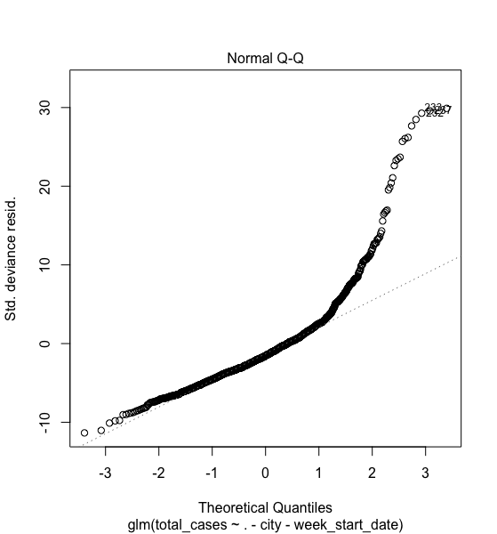

```{r include=FALSE}

source('a3_part2.R')
library('ggplot2')
library('kableExtra')
```

# Statistical Modeling

Firstly, we investigate if there is any correlation between our response variable of the data (total number of cases every week of the year) and each of the individual variables or in this case they can be referred to as predictors. We run these statistics tests separately for the San Juan data and Iquitos data as the predictors are geographical factors such as prediction, humidity, vegetation and thus are unique to each city.      

Here we are taking the liberty to make few simplifications regarding the data for the purpose of modeling. To perform **Spearman and Kendall-Tau Correlation** Analysis, we simplify the information regarding the data that the values of the predictors have some kind of order to them, that is, they're either increasing or decreasing. These Spearman and Kendall Coefficients helps us determine if the predictor has a non-linear relationship with the response variable.

#### Correlation coefficients of San Juan data

```{r echo=FALSE, message=FALSE}
kable(corr_coeff_sj) %>%
  kable_styling(bootstrap_options = "striped", full_width = F, position = "left")
```

#### Correlation coefficients of Iquitos data

```{r echo=FALSE, message=FALSE}
kable(corr_coeff_iq) %>%
  kable_styling(bootstrap_options = "striped", full_width = F, position = "left")
```

From the above two tables, we can see that only *reanalysis_relative_humidity_percent, reanalysis_specific_humidity_g_per_kg,* and *station_max_temp_c* has a statistically significant correlation with the Response variable, however, the correlation is very low to contribute meaningfully to the model. From the above result, we realize that the variables don't have a strong linear relationship with the response.        

##### Poisson Regression

We decided to chose *Poisson Regression* because it is useful for predicting an outcome variable representing counts from a set of continuous predictor variables. We performed the analysis using *Negative Binomial Regression* as well, Negative binomial regression can be used for over-dispersed count data, that is when the conditional variance exceeds the conditional mean. However, Negative binomial regression can be considered as a generalization of Poisson regression since it has the same mean structure as Poisson regression and it has an extra parameter to model the over-dispersion. If the conditional distribution of the outcome variable is over-dispersed, the confidence intervals for Negative binomial regression are likely to be narrower as compared to those from a Poisson regression. Thus, our outputs were very similar, and poisson regression outperformed negative binomial regression by a very narrow margin.      


The plots obtained using Poisson Regression are attached below:




From the above plots we can notice that as we increase the number of variables used to fit the model, the residuals are more scattered, and after a certain increase the model does not seem to be improving. However, we can see a pattern in the residuals of the predicted values and this doesn’t mean that there’s something wrong with the analysis; it just means that there is some unexplained difference. In other words, the residual is the error that isn’t explained by the regression line. 

Since we could see from the regression plot that not all variables contribute towards the model, we need to remove the features that are irrelevant. That is, we need to perform **Feature Selection** to decide the variables we will be using to make a predictive model in the future.

##### Feature Selection

We used **Recursive Feature Elimination Method** to obtain the best subset of the feature variables. It is a greedy optimization algorithm which aims to find the best performing feature subset. It repeatedly creates models and keeps aside the best or the worst performing feature at each iteration. It constructs the next model with the left features until all the features are exhausted. It then ranks the features based on the order of their elimination. We used Recursive Feature Elimination Method instead of Forward Selection method because we learned that the former provides more accurate and detailed feature selection algorithm, and we wanted to experiment a new method as well, in fact, it turned out very successful.

Using the recursive feature elimination, we were abled to compute the importance of each variable is to the Response (total_cases). In other words, we noticed that after 13 variables, the new variable being added to model depreciates the accuracy of the model. This is represented clearly in the graph below:

###### Importance of each variable in San Juan data


###### Importance of each variable in Iquitos data


An interesting observation to note from the above plot is that the different factors seem to contribute towards the dissemination of the dengue virus and aedes mosquito, and this provides more clarity. We cannot model San Juan data and Iquitos data together as they both are dependent on different variables.

## Interpretation 

From the feature selection model we used in the above section, we can obtain the features that more meaningful to be modeled with. The graph below shows the performance of the model, this is measured using RMSE or Root mean squared error, and the model is a better fit if RMSE is lower. 


And thus we performed Poisson regression after removing the following variables from the respective datasets:

Features selected and rejected for San Juan data:


Features Selected and rejected for Iquitos data:


On performing the poisson regression we could observe a slight improvement in the performance of the model, or in other words the residual errors were reduced and less random, which still remains unexplainable with the available data and information. 


However, this model and the features that were derived to be *important* from recursive feature elimination method suprising did not coorelate with the inital data analysis we had perofrmed and displayed as visualizations. From our research about climatic influence on the aedes mosquitos and the dengue virus, we speculated that precipitation plays a major role and vegetation does not a significant influence. But, from the Feature Selection model and Poisson regression, we can see that these are key players in the model, and we also introspect that interaction of these variables (polynomial or ratio or both) might be a major influencer for the model, however it is not in the scope of this report. 

Overall, through our analysis we can conclude than we can associate environmental variables such as hudity and mean vegetation to the change in dengue cases to a greater extent than variables such as temperature and precipitatioin. This is important to point out because, one of the common understanding of the dissemination of dengue virus is that higher temperature and dampness caused by rain/precipitation foster their replication. These environmental changes singularly cannot predict changes in dengue cases with high accuracy, however, this might change with further parameter tuning and most importantly **Feature Creation**.
